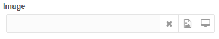
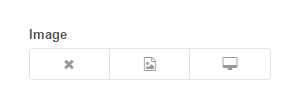

# mixedimage

mixedImage - modx custom TV  


## version 2.-.-

### 2.0.1

By [SintezCode](https://github.com/SintezCode) 
* Переписана вся extjs часть для возможности использования Ext.extend и Ext.override
* Триггеров теперь может быть сколько угодно, им можно задавать свою ширину и обработчики при вызове, расширении или переопределении.
* Ширина поля теперь зависит от количества триггеров и их ширины. Нет необходимости прописывать их в css.
* Добавлена возможность загрузки в заранее определённый путь, который может быть установлен другими компонентами.
* При загрузке на сервер теперь отправляются все поля с текущей формы ресурса, что открывает больше возможностей для генерации пути загрузки.


##### Скриншот v2


**- Изменен внешний вид** 

**- Добавлены новые возможности:** 
* Возможность руками вписать путь к файлу
* Новая настройка при создании TV: Удаление файла, если выставлено "Да", то при очистке поля файл физически удаляется с сервера
* Открывает сразу папку указаную в настройках TV (от корня источника фалов)

**- Поправлено несколько небольших багов:** 
* работа системной настройки "Загружать только при редактировании"
* опечатки в лексиконах
* правильный текст ошибок
* ошибка транслитерации если файл уже существует


--------------------------------------
### Как я работаю с migx 

* Создаю TV (например migx_img) с типом **Смешанная загрузка файла**, не назначая никакому шаблону, настраиваю согласно текущему проекту (указываю источник файлов или папку) 
* Создаю TV (например slider) с типом **migx** и в конфигурации (Вкладки формы) для поля с изображением пишу такие строки для каждой необходимой картинки

```json
 {"field":"image","caption":"Изображение 1","inputTV":"migx_img"},
 {"field":"image2","caption":"Изображение 2","inputTV":"migx_img"}
```

И тогда при добавления новой строки в migx будут поля выбора файла согласно типу migx_img

--------------------------------------


## version 1.-.-

##### Скриншот v1


Добавляет новый тип TV поля: **Смешанная загрузка файла/Mixed Image Input**

*Является сместью FastUploadTV и стандартной загрузки файлов, часть кода взята из [FastUploadTV](https://github.com/promo360/fastuploadtv)*

Данный тип поля позволяет прикреплять изображения к ресурсам используя стандартный менеджер файлов, либо напрямую с компьютера пользователя, минуя все остальные шаги.
Предназначен для загрузки изображений, но может загружать и другие типы файлов, разрешенные для загрузки в системных настройках сайта, но в данном случае необходимо отключить показ миниатюр, чтобы не было битой картинки.

#### При создании TV такого типа можно указать следующие настройки: 

**- Путь сохранения** - папку в которую будут загружаться картинки с компьютера пользователя (ВАЖНО: при указании источника файлов отличным от стандартного, этот путь будет браться с учетом папки источника файлов)
*Например вы создали новый источник файлов IMAGES и указали ему путь assets/images/ (в настройках источника файлов), а в поле Путь сохранения указали папку uploads/ - итоговая папка загрузки файлов будет такой: assets/images/uploads/*

**- Префикс имени файла** - добавляет данную строку в начало наименования файла, можно использовать различные плейсхолдеры. Пример: {rand}_

* {id} - ID ресурса
* {pid} - ID ресурса родителя
* {alias} - Алиас ресурса
* {palias} - Алиас ресурса родителя
* {tid} - ID доп. поля (tv)
* {uid} - ID юзера
* {rand} - Случайная строка *(количество символов указывается в системных настройках)*
* {t} - Время в формате timestamp
* {y} - Год
* {m} - Месяц
* {d} - День
* {h} - Час
* {i} - Минута
* {s} - Секунда

**- Принимаемые типы MIME** - указывает какие типы файлов можно загружать (по умолчанию те что указаны в системных настройках modx)
*Например: image/jpeg, image/png, application/pdf*

**- Использовать префикс как имя файла** - позволяет не обращать внимания на пользовательское название файла и полностью заменить его на значение из поля **Префикс имени файла**

**- Показать изображение** - выводить под полем изображение миниатюры или нет *(по умолчанию выводит)*. 

**- Показывать значение TV** - выводить под полем путь к загруженному файлу или нет *(по умолчанию выводит)*

**- Параметры для ресайза изображений** - параметры для modphpthumb.

*Примеры: <br>
w=200&h=200&zc=1   <br>
для наложения ватермарка:   <br>
fltr=wmt|Hello|60|C|ff0000|   <br>
fltr=wmi|/assets/wt.png|C|   <br>*

------


###Системные настройки

**- mixedimage.random_lenght** - Длина строки для плейсхолдера {rand} 

**- mixedimage.translit** - Транслитерация файлов, позволяет заменять кириллицу на латиницу в названии файла во избежание возможных проблем на некоторых хостингах. Настройка работает только при установленном дополнении "translit"